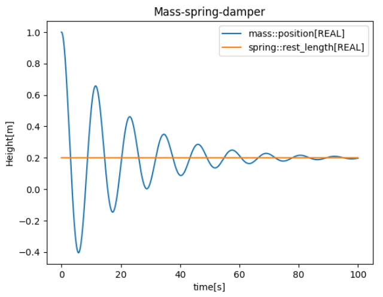

# Summary

Ecos is a cross-platform framework for running co-simulations adhering to the Functional Mock-up Interface (FMI)
standard [@blochwitz2012functional];
an open standard for model exchange and co-simulation of dynamic systems.
An FMU (Functional Mock-up Unit) is a self-contained component that implements the FMI standard.
It is packaged as a zip archive containing:

- A shared library for each supported platform, which implements a standardized C interface.
- A *modelDescription.xml* file, describing the FMU's capabilities and available variables.
- Optionally, component-specific resources embedded within the archive.

The intention of Ecos is to provide a streamlined way of working with such FMUs,
and supports version 1.0, 2.0 and 3.0 of the standard with respect to co-simulation.
In particular, support for FMI 3.0[@junghanns2021functional] is still missing in many tools,
and Ecos aims to help bridge this gap by providing basic support for this version. 
In collaboration with interested users, Ecos aims to gradually expand its support for FMI 3.0, 
working toward a more complete and practical implementation of the standard over time.
Ecos also supports the System Structure &
Parameterization (SSP) standard[@kohler2016modelica], which can be used to import systems of
FMUs in a structured and tool-agnostic way.
Ecos consists of a Command Line Interface (CLI), as well as a C++ library, _libecos_,
with interfaces provided in C and Python. The Python package is available through the
pypy package index as _ecospy_. The project is structured as a mono-repo with a major goal of
being simple to build. This also implies few and light-weight dependencies.

Some features available with Ecos:

* Support for SSP 1.0.
* Support for FMI 1.0, 2.0 & 3.0 for Co-simulation.
* Built-in plotting capabilities with inline and XML configuration options.
* CSV writer with inline and XML configuration options.
* Scenarios - actions to run at specific events.
* Remoting - allowing models to interact across processes/computers.

In particular, remoting is a key feature of Ecos, allowing model instances to be automatically
distributed across processes on a local machine. Instances may also be distributed across computers by 
manually booting a server application and passing their ip-address to Ecos.

\autoref{fig:plot} demonstrates a simulation of a simple *mass-spring-damper* system with Ecos.
The models are packaged following the SSP standard and subsequently simulated and plotted with _libecos_.

# Statement of need

While similar tooling exists like FMPy[@FMPy], Vico[@hatledal2021vico], Open Simulation Platform (
OSP) [@smogeli2020open] and OMSimulator[@ochel2019omsimulator], Ecos aims to deliver a higher level of
flexibility, extensibility and accessibility
through an easy to build and consume package. In particular,
Ecos acts as a successor to the JVM based Vico framework.

Table 1 compares Ecos with some of the other available tools. While seemingly similar, 
Ecos niche is to provide an intuitive low-level C++ API, simple yet powerful Python, C and CLI interfaces, as well as 
support for all three versions of FMI for Co-simulation and built-in means of distributing simulation components across 
processes, while also keeping build dependencies to a minimum.

### Table 1: Comparison of tools.
| Feature        | FMPy                       | OMSimulator           | OSP             | Ecos                 |
|----------------|----------------------------|-----------------------|-----------------|----------------------|
| Language       | Python                     | C, Lua, Python        | C++, C, Python  | C++, C, Python       |
| FMI Support    | FMI 1.0, 2.0, 3.0 (ME, CS) | FMI 2.0, 3.0 (ME, CS) | FMI 1.0, 2.0 CS | FMI 1.0, 2.0, 3.0 CS |
| Co-simulation  | Yes                        | Yes                   | Yes             | Yes                  |
| Model Exchange | Yes                        | Yes                   | No              | No                   |
| GUI            | Basic (Individual models)  | Yes (OMEdit)          | No              | No                   |
| CLI            | Yes                        | No                    | Yes             | Yes                  |
| License        | BSD                        | OSMC-PL               | MPL             | MIT                  |

The software is currently being used to support the EU project TWINVEST, where NTNU is a partner.

# Future of Ecos

Ecos currently ships with a capable, but simple Jacobi-type _fixed_step_ orchestration algorithm. 
The algorithm can run models in parallel, and individual model may run at different rates.
The API is designed to be extensible, and the goal is to include more advanced orchestration algorithms.
However, pursuing this should be driven by a clear user need. In this respect, users are encouraged to provide 
use-cases and sample simulations systems where more advanced orchestration algorithms are needed.

# References